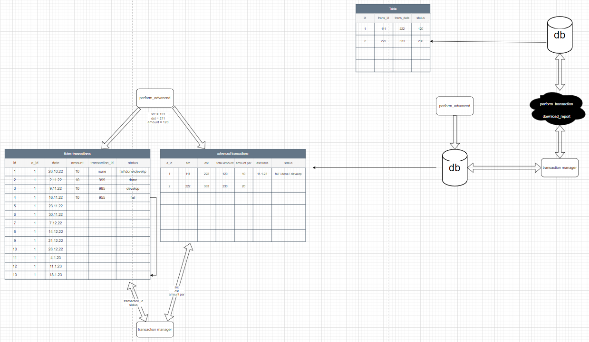
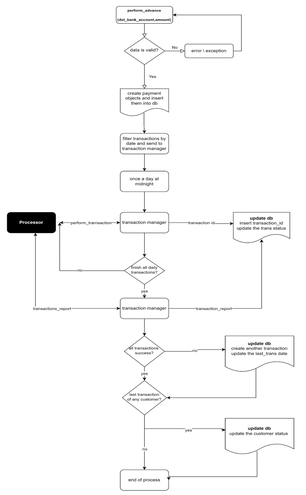
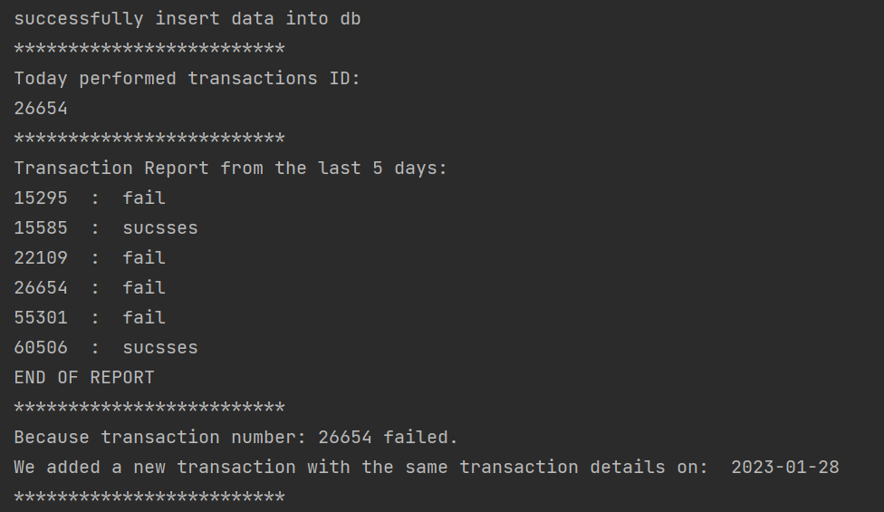

## billing-system


A personal project I created. This project is a complete billing system, using PostgreSQL and flask HTTP serveres.
The system credits the customer with the amount.
In the following 12 weeks, the system performs debits of amount/12 once a week.
A failed debit is moved to the end of the repayment plan (a week from the last payment).


the system architecture:





## Processor
the processor contains 2 functions:
* perform_transaction - This call returns a transaction_id (random number betweem 10000-99999)

*  download_report - 
Downloads a daily report of transaction results. It contains info about transactions from the last 5 days.


     


the system flow:


## Billing system
The billing system 
	
## Setup

* To run the processor:

```console
python processor/processor.py
```

* To run the billing system:
```console
python billing/billing_system.py
```

* To call the perform_advance API:
```console
python main.py
```



